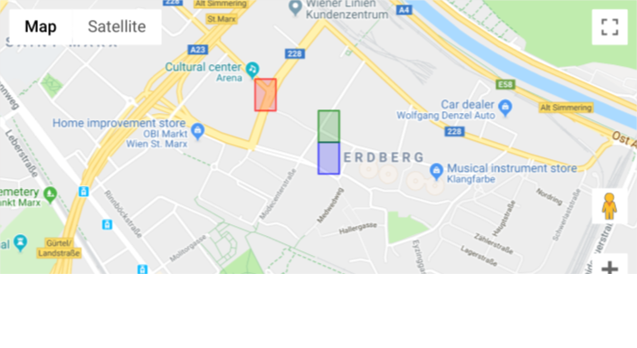

# Flash - Data Science Competition
This readme serves as an explanatory walk through of my analysis. It documents the process of trying to solve an allocation problem. To be precise, **where should shared scooters be placed in the morning to gain the most traction during the following day?** The goal in this particular case is to come up with an informed decision based on a log file of one day in Vienna. It is implied in the task that there is a high demand on scooters but not enough close by to satisfy all of it. Therefore zones of high demand have to be identified. We want to avoid the concentration of a large number of scooters in an area with scarce demand and the lack of scooters in areas with high demand. As there is no data provided indicating user requests, i.e. demand, the usage of scooters has to serve as a proxy. This might lead to biases because areas might only be very active **BECAUSE** there have been many scooters in the first place.
Intuitively filtering out highly active scooters, analyzing how they differ from the others and reallocate accordingly might be a good idea. To know for sure, we need to see what the actual data says. The very first step here is to have a detailed look at the data, the exploratory data analysis (EDA).

## Structure
The analysis is done using mainly Jupyter notebooks as they have been proven best suitable for explaining one-time analyses. To follow the line of thought of the analysis, these should be executed in the indicated order (0,1,...). Additionally there is a python script called `helper_functions.py` which holds a couple of functions which are being used throughout. The Gmaps integrations cannot be saved inside the notebook unfortunately, so it has to be rerun. They are however also saved as png files inside the plots folder in the respective order.

## Prerequisites
- Put the data file (`vienna_scooter_positions.csv`) into the `data` folder.
- To simply install all Python modules used in this analysis, run
`pip install -r requirements.txt` while inside the folder. (Specific versions do not matter if the latest are being used.)
- For gmaps use in Jupyter you might need to [activate widgets]( https://jupyter-gmaps.readthedocs.io/en/latest/install.html#).
- Additionally you want to [create an API key](https://console.developers.google.com/flows/enableapi?apiid=maps_backend,geocoding_backend,directions_backend,distance_matrix_backend,elevation_backend&keyType=CLIENT_SIDE&reusekey=true) (if you don't have one already) to communicate with the GMaps API. Insert the key in the options (cell 3) in `1_groundtruthing_gmaps.ipynb`.

## Notebooks
Short overview of each notebook's purpose, for more detail refer to the notebook itself.

### Preprocessing & EDA
We start by simply analyzing the dataset to find out as much as we can before we decide on the next steps. This includes generation of variables like *times seen*, *times used* and so on. Also we check the distribution of usage over the day.

### Groundtruthing via GMaps
We have a good first picture about the data and some ideas what we can make out of it. In this notebook the focus lies on checking the data points in connection with Vienna and its streets, districts and POIs. Also we check out the difference between morning and evening locations of the scooters. We define polygons of activity based on a granularity of three decimal places.

### Feature Engineering
In this notebook we generate features for locations that can characterize their demand/activity. This includes the time scooters were inactive/parked as well as the distances traveled. After that, we further check out peak times to create an activity index for the morning.

### Clustering & Relocation
In order to better understand different types/classes of locations we cluster them by the previously generated features and take a closer look which includes a turnable 3D projection using Principal Component Analysis. We then characterize the clusters based on the parameters of the associated locations which leads us to three different types:
- Early Peak
- Late Peak
- Activity Zone

The last step is the reallocation of one third (assumptions about the Operation Team's capabilities have been made) of the scooters. We choose the worst placed ones and put them into the closest cluster using a Haversine distance approximation. In order to define the optimum number for very active locations we developed the following formula:
>`n_scooters_opt = (morning_count + early_peak) ** sqrt(activity_index)`

## Conclusion
The final results for relocation, i.e. scooters which need to be relocated over night, can be found in the file `scooter_relocation.csv`. Their new locations are marked with `lat_new` and `lon_new`. Note that these are coordinates rounded to the third decimal place and therefore signify a polygon area and not a point location (more explanation can be found in `1_groundtruthing_gmaps.ipynb`). This enables the Operations Team to also apply their domain knowledge of the city of Vienna for exact locations.

## Ideas for improvement & recommendations
- One of the main recommendations would be to create a probability score of usage based on the night location and then matching this with areas of high demand via the app.
- Instead of measuring activity for the whole day, measure it for the peaks (morning, afternoon, evening) and relocate in between!
- Disaggregation: Construct different models/algorithms per country, weekday and scooter class. For example, the decision of the German government on 17th of May this year about restricting scooters to bike paths only and no pedestrian zones influences the demand differently than in countries where 12 km/h scooters are allowed everywhere.
- Use actual routing information instead of Haversine proxy.
- Using additional data sources (like activity areas inside a city together with target groups or event specific areas on special days).
- Use data about requests/searches, reservations, cancellations via the app to better understand user behavior.
- Offer discounts/incentives for users to park in specific locations (like Lidl bike does it). These can then even be redefined per hour (like most active area during lunch time and so on).

## Open questions
- How to determine new usage vs. a scooter being relocated?
- Where does the difference in pinging come from? (To Backend Team)
- Task specific: "...satisfy all the demands of different teams?"" I only see one, the Operations Team. What is the Backend Team demanding?
